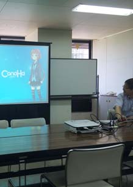

第10回まどべん四日市のチラシ案
========================

## キャッチ
「四日市でIT勉強会やってます。ぜひ来てみて下さい。」
## 日程
10月18日（土）もしくは10月25日（土）
## 「まどべん四日市」とは
四日市で2,3ヶ月に1度開催されているプログラマー同士の勉強会です。話題はMicrosoft系のものが多いですが、それ以外の話題も取り上げています。毎回3,4人の方々が少し長めの発表をし、それ以外の方もライトニング・トークをしたりします。勉強会が終わったあとは、おいしい懇親会があります。
## 勉強会サイト（Facebook）
まどべんよっかいち：https://www.facebook.com/MadobenYokkaichi
## 前回のタイムテーブル

|時間	|内容	|
|-------|------|
|13:30 – 13:35	|まどべんよっかいちについて nobu|
|13:35 – 13:50	|参加者による自己紹介|
|13:50 – 14:40	|kekyoさん「いまさら恥ずかしくてasyncをawaitした」|
|14:40 – 15:00	|休憩＆発表準備|
|15:00 – 15:30	|植田さん「StackOverflowを始めよう」|
|15:30 – 15:50	|休憩＆発表準備|
|15:50 – 16:30	|nobu「Windows.Web.Http.HttpClientとWebAuthenticationBroker」|
|16:30 – 16:50	|ライトニングトーク or フリートーク or 振り返り|
|16:50 – 17:00	|撤収作業|

## 前回の様子

## 参加申し込みサイト
http://madoben.doorkeeper.jp/